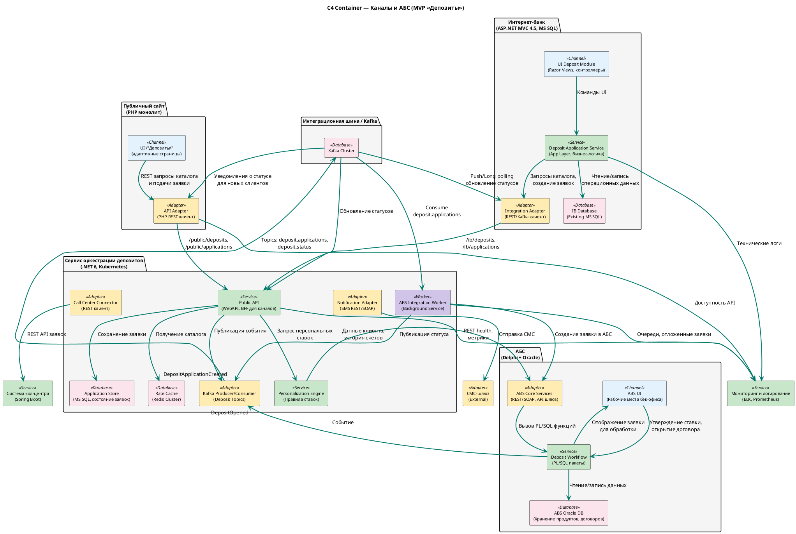

```puml
@startuml container
skinparam backgroundColor #FFFFFF
skinparam handwritten false
skinparam defaultTextAlignment center
skinparam wrapWidth 220
skinparam arrowColor #00796B
skinparam arrowThickness 2
skinparam package {
  BackgroundColor #F5F5F5
  BorderColor black
  FontSize 12
}
skinparam rectangle {
  BackgroundColor<<Channel>> #E3F2FD
  BackgroundColor<<Service>> #C8E6C9
  BackgroundColor<<Adapter>> #FFECB3
  BackgroundColor<<Database>> #FCE4EC
  BackgroundColor<<Worker>> #D1C4E9
  BorderColor black
  FontSize 11
}

title C4 Container — Каналы и АБС (MVP «Депозиты»)

package "Публичный сайт\n(PHP монолит)" {
  rectangle "UI \"Депозиты\"\n(адаптивные страницы)" <<Channel>> as PublicUI
  rectangle "API Adapter\n(PHP REST клиент)" <<Adapter>> as PublicAdapter
}

package "Интернет-банк\n(ASP.NET MVC 4.5, MS SQL)" {
  rectangle "UI Deposit Module\n(Razor Views, контроллеры)" <<Channel>> as IBUi
  rectangle "Deposit Application Service\n(App Layer, бизнес-логика)" <<Service>> as IBService
  rectangle "Integration Adapter\n(REST/Kafka клиент)" <<Adapter>> as IBAdapter
  rectangle "IB Database\n(Existing MS SQL)" <<Database>> as IBDB
}

package "Сервис оркестрации депозитов\n(.NET 6, Kubernetes)" {
  rectangle "Public API\n(WebAPI, BFF для каналов)" <<Service>> as OrchestrationAPI
  rectangle "Personalization Engine\n(Правила ставок)" <<Service>> as Personalization
  rectangle "Application Store\n(MS SQL, состояние заявок)" <<Database>> as AppDB
  rectangle "Rate Cache\n(Redis Cluster)" <<Database>> as RateCache
  rectangle "Kafka Producer/Consumer\n(Deposit Topics)" <<Adapter>> as KafkaClient
  rectangle "ABS Integration Worker\n(Background Service)" <<Worker>> as ABSWorker
  rectangle "Notification Adapter\n(SMS REST/SOAP)" <<Adapter>> as NotificationAdapter
  rectangle "Call Center Connector\n(REST клиент)" <<Adapter>> as CallCenterAdapter
}

package "Интеграционная шина / Kafka" {
  rectangle "Kafka Cluster" <<Database>> as KafkaCluster
}

package "АБС\n(Delphi + Oracle)" {
  rectangle "ABS UI\n(Рабочие места бэк-офиса)" <<Channel>> as ABSUI
  rectangle "Deposit Workflow\n(PL/SQL пакеты)" <<Service>> as ABSWorkflow
  rectangle "ABS Core Services\n(REST/SOAP, API шлюз)" <<Adapter>> as ABSAPI
  rectangle "ABS Oracle DB\n(Хранение продуктов, договоров)" <<Database>> as ABSDB
}

rectangle "СМС-шлюз\n(External)" <<Adapter>> as SmsGateway
rectangle "Система кол-центра\n(Spring Boot)" <<Service>> as CallCenterSystem
rectangle "Мониторинг и логирование\n(ELK, Prometheus)" <<Service>> as Monitoring

PublicUI --> PublicAdapter : REST запросы каталога\nи подачи заявки
PublicAdapter --> OrchestrationAPI : /public/deposits,\n/public/applications

IBUi --> IBService : Команды UI
IBService --> IBAdapter : Запросы каталога,\nсоздание заявок
IBService --> IBDB : Чтение/запись\nоперационных данных
IBAdapter --> OrchestrationAPI : /ib/deposits,\n/ib/applications

OrchestrationAPI --> Personalization : Запрос персональных\nставок
Personalization --> ABSAPI : Данные клиента,\nистория счетов
ABSAPI --> ABSWorkflow : Вызов PL/SQL функций
ABSWorkflow --> ABSDB : Чтение/запись данных

OrchestrationAPI --> RateCache : Получение каталога
OrchestrationAPI --> AppDB : Сохранение заявки
OrchestrationAPI --> KafkaClient : Публикация события\n"DepositApplicationCreated"
KafkaClient --> KafkaCluster : Topics: deposit.applications,\ndeposit.status
KafkaCluster --> ABSWorker : Consume\ndeposit.applications
ABSWorker --> ABSAPI : Создание заявки в АБС
ABSWorker --> KafkaClient : Публикация статуса
KafkaCluster --> OrchestrationAPI : Обновление статусов
KafkaCluster --> IBAdapter : Push/Long polling\nобновление статусов
KafkaCluster --> PublicAdapter : Уведомления о статусе\nдля новых клиентов

ABSWorkflow --> ABSUI : Отображение заявки\nдля обработки
ABSUI --> ABSWorkflow : Утверждение ставки,\nоткрытие договора
ABSWorkflow --> KafkaClient : Событие\n"DepositOpened"

NotificationAdapter --> SmsGateway : Отправка СМС
CallCenterAdapter --> CallCenterSystem : REST API заявок

OrchestrationAPI --> Monitoring : REST health,\nметрики
IBService --> Monitoring : Технические логи
PublicAdapter --> Monitoring : Доступность API
ABSWorker --> Monitoring : Очереди, отложенные заявки

@enduml
```

