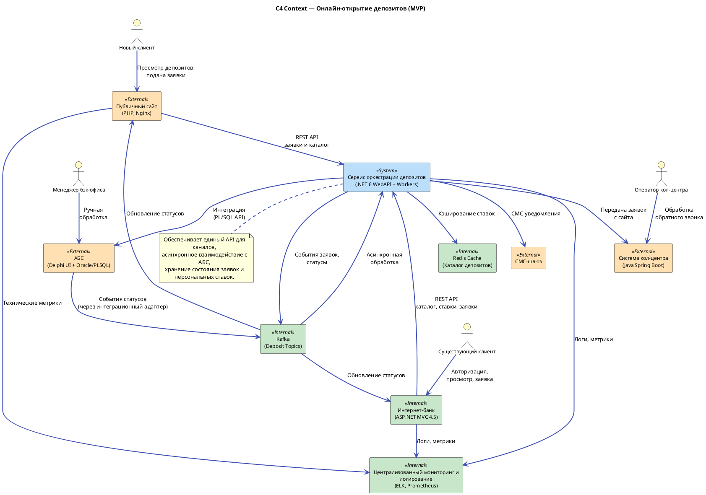

```puml
@startuml context
skinparam backgroundColor #FFFFFF
skinparam handwritten false
skinparam defaultTextAlignment center
skinparam wrapWidth 220
skinparam arrowThickness 2
skinparam arrowColor #3F51B5
skinparam rectangle {
  BackgroundColor<<System>> #BBDEFB
  BackgroundColor<<External>> #FFE0B2
  BackgroundColor<<Internal>> #C8E6C9
  BorderColor black
  FontSize 12
}
skinparam actor {
  FontSize 12
  BackgroundColor #FFF9C4
  BorderColor black
}

title C4 Context — Онлайн-открытие депозитов (MVP)

actor "Новый клиент" as CustomerNew
actor "Существующий клиент" as CustomerExisting
actor "Менеджер бэк-офиса" as BackOffice
actor "Оператор кол-центра" as CallCenterOperator

rectangle "Публичный сайт\n(PHP, Nginx)" <<External>> as PublicSite
rectangle "Интернет-банк\n(ASP.NET MVC 4.5)" <<Internal>> as InternetBank
rectangle "Сервис оркестрации депозитов\n(.NET 6 WebAPI + Workers)" <<System>> as Orchestration
rectangle "Kafka\n(Deposit Topics)" <<Internal>> as Kafka
rectangle "Redis Cache\n(Каталог депозитов)" <<Internal>> as Redis
rectangle "АБС\n(Delphi UI + Oracle/PLSQL)" <<External>> as ABS
rectangle "СМС-шлюз" <<External>> as SmsGateway
rectangle "Система кол-центра\n(Java Spring Boot)" <<External>> as CallCenterCRM
rectangle "Централизованный мониторинг и логирование\n(ELK, Prometheus)" <<Internal>> as Monitoring

CustomerNew --> PublicSite : Просмотр депозитов,\nподача заявки
CustomerExisting --> InternetBank : Авторизация,\nпросмотр, заявка
PublicSite --> Orchestration : REST API\nзаявки и каталог
InternetBank --> Orchestration : REST API\nкаталог, ставки, заявки
Orchestration --> Redis : Кэширование ставок
Orchestration --> Kafka : События заявок,\nстатусы
Kafka --> Orchestration : Асинхронная\nобработка
Orchestration --> ABS : Интеграция\n(PL/SQL API)
BackOffice --> ABS : Ручная\nобработка
Orchestration --> SmsGateway : СМС-уведомления
Orchestration --> CallCenterCRM : Передача заявок\nс сайта
CallCenterOperator --> CallCenterCRM : Обработка\nобратного звонка
Orchestration --> Monitoring : Логи, метрики
InternetBank --> Monitoring : Логи, метрики
PublicSite --> Monitoring : Технические метрики
ABS --> Kafka : События статусов\n(через интеграционный адаптер)
Kafka --> InternetBank : Обновление статусов
Kafka --> PublicSite : Обновление статусов

note bottom of Orchestration
  Обеспечивает единый API для каналов,
  асинхронное взаимодействие с АБС,
  хранение состояния заявок и персональных ставок.
end note

@enduml
```