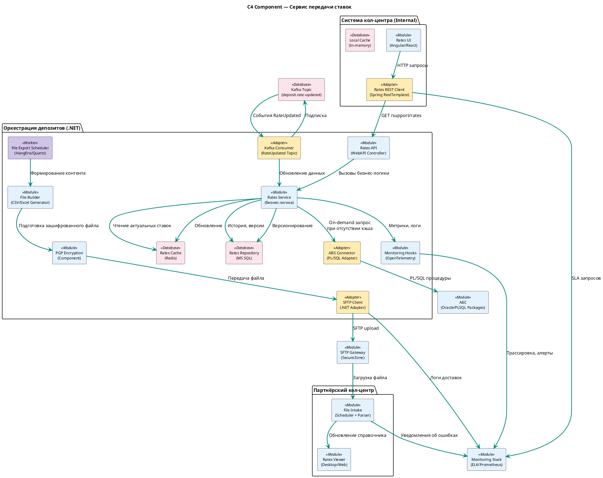

```puml
@startuml component
skinparam backgroundColor #FFFFFF
skinparam handwritten false
skinparam defaultTextAlignment center
skinparam arrowThickness 2
skinparam arrowColor #00897B
skinparam rectangle {
  BackgroundColor<<Module>> #E3F2FD
  BackgroundColor<<Adapter>> #FFECB3
  BackgroundColor<<Database>> #FCE4EC
  BackgroundColor<<Worker>> #D1C4E9
  BorderColor black
  FontSize 11
}

title C4 Component — Сервис передачи ставок

package "Оркестрация депозитов (.NET)" {
  rectangle "Rates API\n(WebAPI Controller)" <<Module>> as RatesAPI
  rectangle "Rates Service\n(бизнес-логика)" <<Module>> as RatesService
  rectangle "Rates Cache\n(Redis)" <<Database>> as RatesCache
  rectangle "Rates Repository\n(MS SQL)" <<Database>> as RatesRepository
  rectangle "ABS Connector\n(PL/SQL Adapter)" <<Adapter>> as ABSConnector
  rectangle "Kafka Consumer\n(RateUpdated Topic)" <<Adapter>> as KafkaConsumer
  rectangle "File Export Scheduler\n(Hangfire/Quartz)" <<Worker>> as ExportScheduler
  rectangle "File Builder\n(CSV/Excel Generator)" <<Module>> as FileBuilder
  rectangle "PGP Encryption\n(Component)" <<Module>> as PgpEncryptor
  rectangle "SFTP Client\n(.NET Adapter)" <<Adapter>> as SftpClient
  rectangle "Monitoring Hooks\n(OpenTelemetry)" <<Module>> as MonitoringHooks
}

package "Система кол-центра (Internal)" {
  rectangle "Rates UI\n(Angular/React)" <<Module>> as InternalUI
  rectangle "Rates REST Client\n(Spring RestTemplate)" <<Adapter>> as InternalRestClient
  rectangle "Local Cache\n(In-memory)" <<Database>> as InternalCache
}

package "Партнёрский кол-центр" {
  rectangle "File Intake\n(Scheduler + Parser)" <<Module>> as PartnerIntake
  rectangle "Rates Viewer\n(Desktop/Web)" <<Module>> as PartnerViewer
}

rectangle "AБС\n(Oracle/PLSQL Packages)" <<Module>> as ABS
rectangle "Kafka Topic\n(deposit.rate-updated)" <<Database>> as KafkaTopic
rectangle "SFTP Gateway\n(SecureZone)" <<Module>> as SFTPGateway
rectangle "Monitoring Stack\n(ELK/Prometheus)" <<Module>> as Monitoring

InternalUI --> InternalRestClient : HTTP запросы
InternalRestClient --> RatesAPI : GET /support/rates
RatesAPI --> RatesService : Вызовы бизнес-логики
RatesService --> RatesCache : Чтение актуальных ставок
RatesService --> RatesRepository : История, версии
RatesService --> MonitoringHooks : Метрики, логи
RatesService --> ABSConnector : On-demand запрос\nпри отсутствии кэша
ABSConnector --> ABS : PL/SQL процедуры

KafkaConsumer --> KafkaTopic : Подписка
KafkaTopic --> KafkaConsumer : События RateUpdated
KafkaConsumer --> RatesService : Обновление данных
RatesService --> RatesCache : Обновление
RatesService --> RatesRepository : Версионирование

ExportScheduler --> FileBuilder : Формирование контента
FileBuilder --> PgpEncryptor : Подготовка зашифрованного файла
PgpEncryptor --> SftpClient : Передача файла
SftpClient --> SFTPGateway : SFTP upload
SFTPGateway --> PartnerIntake : Загрузка файла
PartnerIntake --> PartnerViewer : Обновление справочника

MonitoringHooks --> Monitoring : Трассировка, алерты
SftpClient --> Monitoring : Логи доставок
InternalRestClient --> Monitoring : SLA запросов
PartnerIntake --> Monitoring : Уведомления об ошибках

@enduml
```

