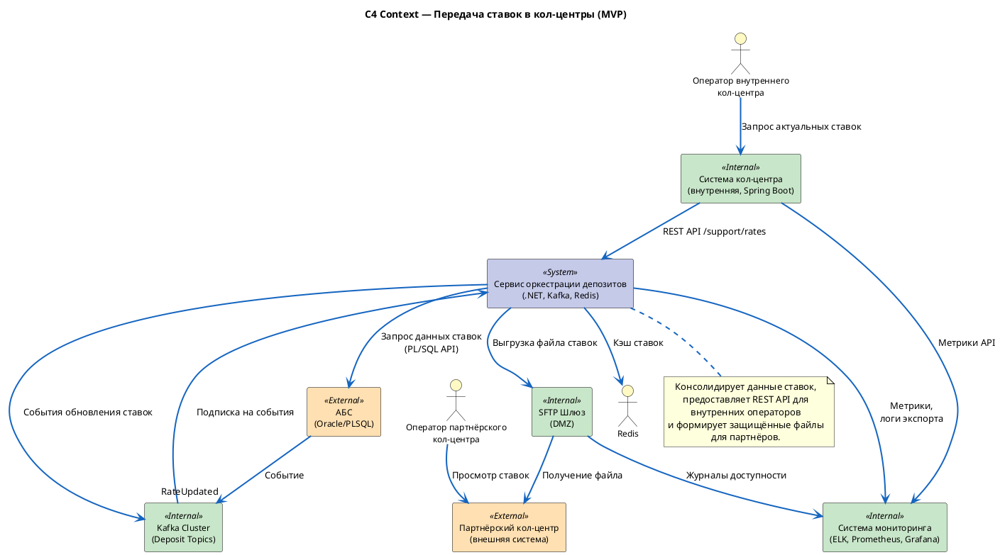

```puml
@startuml context
skinparam backgroundColor #FFFFFF
skinparam handwritten false
skinparam defaultTextAlignment center
skinparam wrapWidth 220
skinparam arrowThickness 2
skinparam arrowColor #1565C0
skinparam rectangle {
  BackgroundColor<<System>> #C5CAE9
  BackgroundColor<<External>> #FFE0B2
  BackgroundColor<<Internal>> #C8E6C9
  BorderColor black
  FontSize 12
}
skinparam actor {
  FontSize 12
  BackgroundColor #FFF9C4
  BorderColor black
}

title C4 Context — Передача ставок в кол-центры (MVP)

actor "Оператор внутреннего\nкол-центра" as InternalAgent
actor "Оператор партнёрского\nкол-центра" as PartnerAgent

rectangle "Система кол-центра\n(внутренняя, Spring Boot)" <<Internal>> as InternalCallCenter
rectangle "Сервис оркестрации депозитов\n(.NET, Kafka, Redis)" <<System>> as Orchestration
rectangle "АБС\n(Oracle/PLSQL)" <<External>> as ABS
rectangle "Kafka Cluster\n(Deposit Topics)" <<Internal>> as Kafka
rectangle "SFTP Шлюз\n(DMZ)" <<Internal>> as SFTP
rectangle "Партнёрский кол-центр\n(внешняя система)" <<External>> as PartnerCallCenter
rectangle "Система мониторинга\n(ELK, Prometheus, Grafana)" <<Internal>> as Monitoring

InternalAgent --> InternalCallCenter : Запрос актуальных ставок
InternalCallCenter --> Orchestration : REST API /support/rates
Orchestration --> Redis : Кэш ставок
Orchestration --> Kafka : События обновления ставок
Kafka --> Orchestration : Подписка на события
Orchestration --> ABS : Запрос данных ставок\n(PL/SQL API)
ABS --> Kafka : Событие "RateUpdated"
Orchestration --> SFTP : Выгрузка файла ставок
SFTP --> PartnerCallCenter : Получение файла
PartnerAgent --> PartnerCallCenter : Просмотр ставок
Orchestration --> Monitoring : Метрики,\nлоги экспорта
InternalCallCenter --> Monitoring : Метрики API
SFTP --> Monitoring : Журналы доступности

note bottom of Orchestration
  Консолидирует данные ставок,
  предоставляет REST API для внутренних операторов
  и формирует защищённые файлы для партнёров.
end note

@enduml
```

